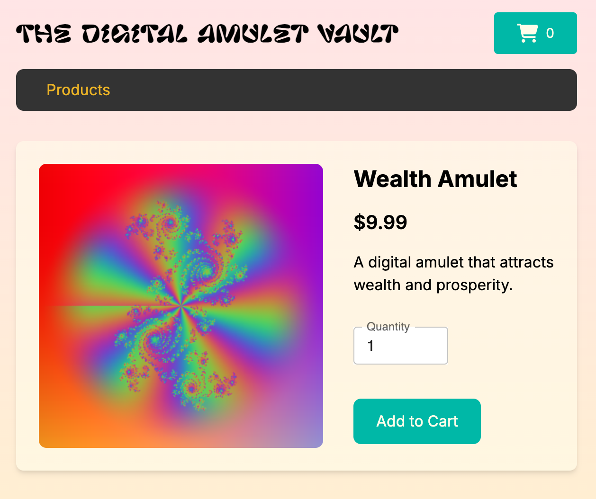

# Digital Amulet Vault

## Description

Digital Amulet Vault is a full-stack e-commerce application where users can explore and purchase digital amulets. The application includes features such as product browsing, shopping cart, checkout process, and a thank you page after purchase.

This project was developed using Next.js, TypeScript, PostgreSQL, and Tailwind CSS with the Emotion library for styling.

## Technologies Used

- **Next.js**: React framework for web applications.
- **TypeScript**: Superset of JavaScript for static typing.he
- **Tailwind CSS**: CSS framework for UI design, enhanced with the Emotion library for additional styling capabilities.
- **Font Awesome**: Icon library.
- **PostgreSQL**: Database for storing product information.
- **WebGL**: Used for rendering shader images and creating dynamic, interactive product visuals.
- **Context API & Cookies**: Manage the state of the shopping cart.

## Deployment and Testing

- **Deployment**: Deployed on Fly.io with continuous integration via GitHub Actions.
- **Testing**: Unit tests are run with Jest, and end-to-end (E2E) tests are executed with Playwright.

## Navigation

1. **Home Page**: List of available products.
2. **Product Detail**: Details of a specific product.
3. **Shopping Cart**: Review of selected products.
4. **Checkout**: Form to complete the purchase.
5. **Thank You**: Confirmation after completing the purchase.
